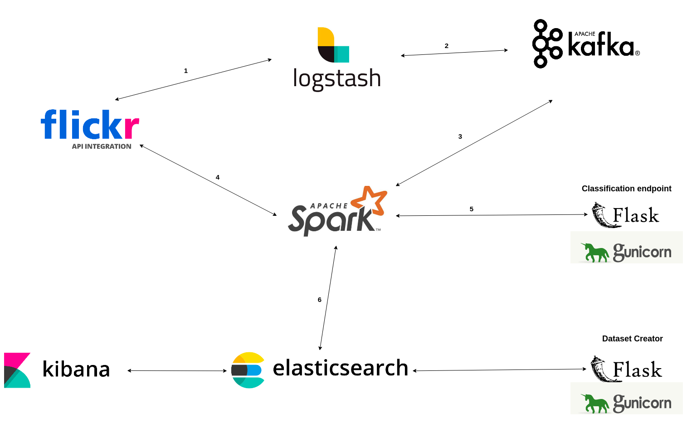

# Real-time Image Classifier, Trends Analyzer, and Dataset Creator

This is the project realized for the exam of the subject 'Technologies for Advanced Programming' (University of Catania, Computer Science Department).

# Architecture

# Disclaimer

<b><h3>This product uses the Flickr API but is not endorsed or certified by SmugMug, Inc.</h3></b>
<h4>I'm not responsible for misuse of this project.</h4>
I also strongly recommend to read the Flickr APIs Terms of Use in order to be aware of what is possible to do and what is not possible to do with Flickr APIs and the data collected through them.

# How to start this project?

1. Set API_KEY and API_SECRET env variables value in 'env' file.
2. Run 'docker compose --env-file env up' command in main folder.
3. Enjoy!
  
# How to query Dataset Creator microservice?

You can use the following url template (Elastichsearch must also be up and running):  

http://localhost:8081/getDataset?class=<class-id\>&max=\<max-urls-to-retrieve\>&min_conf=\<min-confidence-score-the-assigned-class-must-have-to-add-url-in-output-list\>

<h4>N.B.</h4>
- Visit http://localhost:8081/getClasses to get the full list of available class ids. 
- Confidence score is a decimal number in [0.0, 1.0].

  - Setting it to a negative number would cause images with whatever class confidence score to be included in the output list.  
  - Setting it to a number greater than 1.0 would lead to an empty output list.
